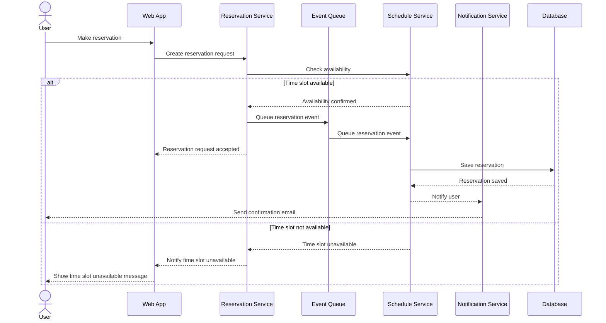

```mermaid
sequenceDiagram
  actor User
  participant Web App
  participant Reservation Service
  participant Event Queue
  participant Schedule Service
  participant Notification Service
  participant Database

  User->>Web App: Make reservation
  Web App->>Reservation Service: Create reservation request
  Reservation Service->>Schedule Service: Check availability

  alt Time slot available
    Schedule Service-->>Reservation Service: Availability confirmed
    Reservation Service->>Event Queue: Queue reservation event
    Event Queue->>Schedule Service: Queue reservation event
    Reservation Service-->>Web App: Reservation request accepted
    Schedule Service->>Database: Save reservation
    Database-->>Schedule Service: Reservation saved
    Schedule Service-->>Notification Service: Notify user
    Notification Service-->>User: Send confirmation email
  else Time slot not available
    Schedule Service-->>Reservation Service: Time slot unavailable
    Reservation Service-->>Web App: Notify time slot unavailable
    Web App-->>User: Show time slot unavailable message
  end
```